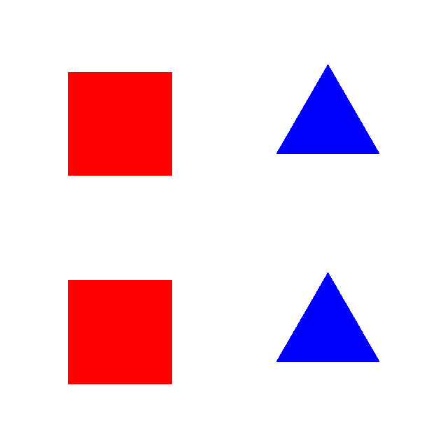

# Assignment 2: Context Free Art in Ruby

[Context Free](https://www.contextfreeart.org/) "is a program that
generates images from written instructions from written instructions
called a grammar".

It has its own external DSL to specify these grammars. Feel free to
download Context Free and play around with it a bit, to get a feel for it.

On Windows, you may want to install
[version 3.3.1](https://www.contextfreeart.org/download/ContextFreeInstall3.3.1.exe)
instead of the latest version (3.4.1), since there appear to be some issues with 3.4.1.

Here's a basic example of a grammar that draws a red square and a blue triangle:

```
startshape shapes

shape shapes {
  // The default square is black, and size "1".
  // The shape adjustment between square brackets
  // adds 0 to the default hue, and
  // adds 1 to the default saturation and brightness,
  // yielding a bright red color
  SQUARE [hue 0 saturation 1 brightness 1]
  // The shape adjustment can also move a shape to the
  // right (x 2).
  TRIANGLE [x 2 hue 240 saturation 1 brightness 1]
}
```

This yields the following result:


The goal of this assignment is to create a similar *internal* DSL
in Ruby, so that we can get the same result with the following Ruby code:

```ruby
startshape :shapes

shape :shapes do
  square hue: 0, saturation: 1, brightness: 1
  triangle x: 2, hue: 240, saturation: 1, brightness: 1
end
```

You can also reuse shapes that you declared, e.g.:

```ruby
startshape :doubled

shape :shapes do
  square hue: 0, saturation: 1, brightness: 1
  triangle x: 2, hue: 240, saturation: 1, brightness: 1
end

shape :doubled do
  shapes
  shapes y: 2
end
```

This yields the following image:



Context Free offers more basic shapes (e.g. circles), but for this assignment
we'll limit ourselves to only squares and triangles.

## The base project

I've already created a lot of the building blocks that you'll need for this
assignment. Your job is primarily to create the DSL. The following classes are
available in the `ContextFree` module:

- [`Adjustment`](src/adjustment.rb):
  describes a [shape adjustment](https://github.com/MtnViewJohn/context-free/wiki/Shape-Adjustments).
- [`Canvas`](src/canvas.rb):
  this is the canvas that we're drawing on (using [Ruby 2D](https://www.ruby2d.com/)).
- [`Color`](src/color.rb):
  describes a color in HSV (or HSB) format.
- [`Properties`](src/properties.rb):
  describes the properties of a shape. These can be modified by the shape adjustment.
- [`Shape`](src/shape.rb):
  describes a shape by its name (`:square`, `:triangle`, or a user-defined shape),
  and its properties.
- [`Transform`](src/transform.rb):
  describes a 2D transformation (move, scale, and rotate).

The parts that you'll have to implement are:

- The [`DSL`](src/assignment/dsl.rb) module.
- The [`Grammar`](src/assignment/grammar.rb) class.

[`main.rb`](src/main.rb) is the entry point of the application. Here's an example of how it can be used:

```shell
$ bundle exec ruby src/main.rb samples/basic.rb
```

Pay special attention to the last lines of that file:

```ruby
load filename, ContextFree::DSL

ContextFree::Canvas.new(ContextFree::DSL.grammar, fps_limit: fps, steps_per_update: incr).show
```

The file provided as the first argument ([`samples/basic.rb`](samples/basic.rb) in
our example) is passed to the [`load`](https://docs.ruby-lang.org/en/3.3/Kernel.html#method-i-load)
method, together with the `ContextFree::DSL` module. This makes it so that the file
is executed within the context of that module, and any methods from that module can
be used.

Afterwards, we take the grammar from that module, and give it to our `Canvas`.

## Installing dependencies

You can use [bundler](https://bundler.io/) to install the required packages
(called gems in the Ruby ecosystem). You can install the dependencies with:

```shell
$ bundle install
```

You may also experience issues if your current directory contains spaces. Make sure
that you put your project in a path that does not contain spaces!

### Windows specific

You may experience issues due to the maximum path length limit on Windows. You can
put your repository at a short path, or you can
[follow these instructions](https://www.autodesk.com/support/technical/article/caas/sfdcarticles/sfdcarticles/The-Windows-10-default-path-length-limitation-MAX-PATH-is-256-characters.html)
to enable long path support.

### macOS specific

If you are on macOS, be sure to install the latest version of Ruby using [Homebrew](https://brew.sh/):

```shell
brew install ruby
```

Also make sure that this is the first Ruby on your `PATH`. The above command should give you instructions on how to do so.

### Linux specific

If you are on Linux, you may need to install some extra dependencies. On
Debian or Ubuntu, you can use:

```shell
$ sudo apt install libsdl2-dev libsdl2-image-dev libsdl2-mixer-dev libsdl2-ttf-dev
```

On Fedora:

```shell
$ sudo dnf install SDL2-devel SDL2_image-devel SDL2_mixer-devel SDL2_ttf-devel
```

## Implementation

### DSL

The DSL should support the following instructions:

#### `startshape`

Example:

```rb
# Draws a rectangle that is 2 wide, and 1 high
startshape :square, size: [2, 1]
```

`startshape` should take the name of the start shape as a `Symbol`, and
keyword arguments describing the adjustments (see [`Adjustment`](src/adjustment.rb))
that should be applied to the start shape, and save the resulting [`Shape`](src/shape.rb)
in the [`Grammar`](src/assignment/grammar.rb)'s `start_shape` member.

#### `background`

Example:

```rb
# Makes the background black
background brightness: 0
```

`background` should take the adjustments (see [`Adjustment`](src/adjustment.rb)) that
should be applied to the default background (the default background color is white),
and save them in the [`Grammar`](src/assignment/grammar.rb)'s `bg_color_adjustment` member.

#### `minsize`

Example:

```rb
# Sets the minimum size
minsize 0.1
```

`minsize` should take a floating point number that indicates how small a shape can get
before it is culled (removed), and save it in the [`Grammar`](src/assignment/grammar.rb)'s
`min_size` member.

#### `shape` and `rule`

`shape` and `rule` are used to add user-defined shapes. When `shape` is used without a block, then all of
the rules that follow apply to that shape. When `shape` is used with a block, then this means that the `shape`
only has a single rule.

A `rule` takes an optional weight and a block that indicates what a user-defined shape expands into. The body of a rule
can invoke 0 or more other shapes. These shapes can be `square`s, `triangle`s, or user-defined shapes.
Every shape can get shape adjustments that adjust the current shape's properties
(see [`Adjustment`](src/adjustment.rb) and [`Properties`](src/properties.rb)).

The weight is used to select which rule is randomly selected.

Example:

```rb
# Declares a shape as a rectangle with width 2 and height 1
shape :rectangle do
  square size: [2, 1]
end
```

This is equivalent to:

```rb
# Declares that the following rules apply to the :rectangle shape
shape :rectangle

# Adds a rule with weight 1 to the :rectangle shape. Since this is the only rule,
# the likelihood of this rule being chosen is 100%.
rule do
  square size: [2, 1]
end
```

In the following example, the square may be red (25% chance) or black (75% chance):

```rb
shape :red_or_black

# No given weight implies a weight of 1
rule do
  # Adjusts the default black color to red
  square hue: 0, brightness: 1, saturation: 1
end

rule 3 do
  # Shapes are black by default
  square
end
```

The likelihood of a rule being chosen is its weight divided by the total weight of all the rules
that apply for a shape.

### Grammar

You'll have to implement the [`Grammar`](src/assignment/grammar.rb) class's `eval_shape` method so it
takes a [`Shape`](src/shape.rb) and expands it to a list of primitive shapes (squares or triangles), and
a list of user-defined shapes by evaluating one of the shape's rules.

Let's look at the `red_or_black` example above. When we call
`eval_shape(Shape.new(:red_or_black, Properties.default))`, then 25% of the time, the result of `eval_shape`
will be equivalent to:

```rb
[[Shape.new(:square, Properties.default.adjust(Adjustments.new(hue: 0, brightness: 1, saturation: 1)))], []]
```

75% of the time, the result will be equivalent to:

```rb
[[Shape.new(:square, Properties.default)], []]
```

#### Selecting a random rule

We can use our [`RNG`](src/rng.rb) to select a random rule.

- If there's only one rule for a shape, then we will always select this rule, **and the RNG is not used**.
- If there's more than one rule for a shape, then we can add up the total (in the previous example this is 4),
  and multiply it by the result of `rng.next` (`rng.next` generates a floating point number between 0 and 1).
  In our example, we now have a number between 0 and 4. If this number is between 0 and 1, then we select the first
  rule (red square). If this number is between 1 and 4, then we select the second rule (black square).

Note: for the test cases to work properly, it is important that the RNG is only used when there's more than 1 rule.

### Adjustments

When evaluating a rule for shape (or declaring our start shape), we need to apply the given adjustments on top
of the current shape's properties.

The following adjustments should be supported (as declared in [`adjustment.rb`](src/adjustment.rb)):

- `x: X`: move horizontally by `X`
- `y: Y`: move vertically by `Y`
- `scale: S`: scale uniformly by `S`
- `scale: [Sx, Sy]`: scale horizontally by `Sx` and vertically by `Sy`
- `rotate: D`: rotate by `D` degrees counter-clockwise
- `hue: H`: add `H` to the current hue (mod 360)
- `saturation: S` (with `S` between -1 and 1): increase the saturation towards `1` if `S` is positive,
   and towards `0` if `S` is negative.
- `brightness: B` (with `B` between -1 and 1): increase the brightness towards `1` if `B` is positive,
  and towards `0` if `B` is negative.
- `alpha: A` (with `A` between -1 and 1): increase the alpha towards `1` if `A` is positive,
  and towards `0` if `A` is negative.

All of these adjustments are already implemented by the [`Adjustment`](src/adjustment.rb) and
[`Properties`](src/properties.rb) classes. All you need to do is create the `Adjustment` object
whenever necessary, and to call the `adjust` method.

## Running tests

There are some tests in the [`spec`](spec) directory. You can run them with:

```shell
$ bundle exec rspec
```

Only the tests in [`grammar_spec.rb`](spec/grammar_spec.rb) test the `DSL` module and `Grammar` class. They use
the samples in the [`samples`](samples) directory.

You can use the samples in the [`samples`](samples) directory to test your code. Every sample consists of three files:

- A `png` file containing a render
- A `cfdg` file in the original Context Free DSL
- An `rb` file containing the specific Context Free Ruby DSL code. This is the file you want to test.

## Rules

- You may only change the files in `src/assignment`. You are allowed add files to the `src/assignment` directory.
  I will copy over the original source code when evaluating, so any other code in `src` will not be evaluated!
- You are allowed to change the RBS files in `sig/assignment`, but this is not within the scope of the assignment.
- You may not add more dependencies (also known as "gems" in the Ruby ecosystem) to the project
  (i.e. you may not change `Gemfile`).
- You may not use AI to generate code for you, but you can use it as a guide.
- Do not share your code with other students. You can help your fellow students, but your code should be your own!

## IDE support

I recommend that you use [RubyMine](https://www.jetbrains.com/ruby/). As a student, you get a free educational license.
There's also a [Ruby LSP extension](https://marketplace.visualstudio.com/items?itemName=Shopify.ruby-lsp) available
for Visual Studio Code, but this requires a bit more setup.

## Documentation

Documentation is generated by [YARDoc](https://yardoc.org/). You can consult the documentation in your browser by
navigating to [`doc/index.html`](doc/index.html).

If you want to update the documentation, you can use the following shell command:

```shell
$ bundle exec yardoc 'src/**/*.rb'
```

## Tips

- The following methods may be useful:
  - [`instance_eval`](https://docs.ruby-lang.org/en/3.3/BasicObject.html#method-i-instance_eval)
  - [`method_missing`](https://docs.ruby-lang.org/en/3.3/BasicObject.html#method-i-method_missing)
  - [`define_method`](https://docs.ruby-lang.org/en/3.3/Module.html#method-i-define_method)
  - [`define_singleton_method`](https://docs.ruby-lang.org/en/3.3/Object.html#method-i-define_singleton_method)
- It may be useful (and cleaner) to create a separate context object for when you are using `instance_eval`.
- You can use a single asterisk (e.g. `*args`) to indicate that a Ruby method
  takes any number of arguments (`args` will be an
  [`Array`](https://docs.ruby-lang.org/en/3.3/Array.html)
  containing the arguments),
  and a double asterisk (e.g. `**kwargs`) to indicate that a Ruby method can
  take any keyword arguments (`kwargs` will be a
  [`Hash`](https://docs.ruby-lang.org/en/3.3/Hash.html)
  from keyword to value).
  You can also use `*` to turn an `Array` into arguments, and `**` to turn a `Hash` into keyword arguments.
  [Here's a blog post](https://noelrappin.com/blog/2024/02/better-know-keyword-arguments/) that clarifies this
  a bit more.
- Before you add randomization to the rule selection, first make sure that you can make it work by always picking
  the first rule.
- Beware for some gotchas:
  - [`forks.rb`](samples/forks.rb) uses a shape called "fork", which is also
    the name of a built-in Ruby method.
  - `startshape` can be a primitive shape (`:square` or `:triangle`), so make sure you handle it properly.
- The
  [solution to the metaprogramming exercises](https://github.com/UCLLAdvancedProgramming/ruby-metaprogramming-exercises/tree/solution)
  from the earlier classes is now available.

## Submitting the assignment

In order to submit your assignment, make a release (see Releases on the right), and tag it as `submission` with title
"Submission".

Then, copy the commit hash (on the command line, you can use `git rev-parse HEAD`), and submit it on Toledo.

Improperly submitted assignments will **not** be evaluated!
